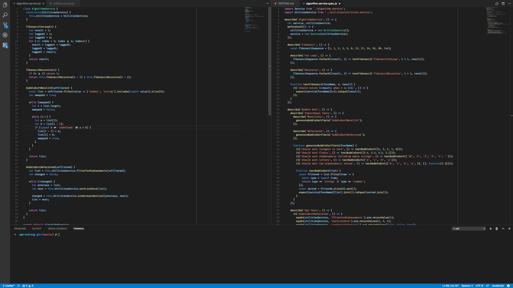

# Installation

- Clone this repo
- Run ```npm install```
- Run ```npm run test```

Running ```npm run test``` will get your tests up and running in a live Chrome window. Find that Chrome window and open Chrome DevTools within it for better debugging.

# Concepts

### Only test the code you want to last

- Dentists advise to "brush the teeth you want to keep". The same principle applies. 
- Prototyping a feature without tests is fine.
- If you're moving code that you care about to prod, write tests with as much detail as budget allows.
- Testing is as important as feature development. A feature without tests is a refactor/bug nightmare just waiting to happen.
- If your feature-focused dev brain says, "But no! Features are the fun part! I want to work on features!", then your dev brain is not converted. Give it time.
- A proper testing framework makes tests much, much easier to write. When tests become cheap to write, you'll wonder why you ever shipped code without tests.
- The goal is to get your testing framework so good that writing tests is a net-positive in the ***near term***. Meaning you can ship features ***faster***.

### How can I ship features faster if I'm writing twice as much code???

- Web devs typically reload their browsers hundreds of times a day. This is a waste.
- Testing tightens your dev cycle into a bunch of tiny, almost instant feedback loops.
- You can develop and release with much greater confidence.
- You'll understand your code better, because your tests will help you think of and address the edge cases.
- Manual testing becomes higher-level. You'll test manually to make sure your styling is there and that your components are loading.
- The underlying code just works.

### Testing code is first-class code

- Tests do not need to be as performant as the underlying code base. Beyond that point, tests need just as much love as features.
- Follow the same best-practices in your tests that you follow for your feature codebase.
- Write small tests.
- Don't repeat yourself
- Write test-only mocks and classes to hide complexity and reduce copy/paste misery.
- As your mocks and test-only classes develop, your tests will become much more condensed and faster to write.

For instance, let's say that a class has ten setters and ten getters. 

1. Make an array of those getter and setter names. 
2. Write a framework function to test a list of getters.
3. Write another framework function for setters.
4. Write a test that loops through and tests your getters.
5. Do the same thing for your setters.

Use your new framework getter/setter testing functions to test all of the getters and setters you write from now on. It's a piece of cake.

### Group your tests into sub-groups

- Use ```describe``` blocks to nest your test code logically.
- If three functions in a class are closely related, nest them in their own ```describe``` block so that they can be moved to a different class later.
- If a function has multiple code paths within itself, create a ```describe``` block for that function and test each code path programatically.
- Write your code and your tests with refactoring in mind. Try to minimize coupling between tests and classes.

### Input/Output vs Spies

- Test that a given input produces a given output for [pure functions](https://en.wikipedia.org/wiki/Pure_function) that do not call other functions.
- If a function has side effects but does not call other functions, an input/output test may still be relevant.
- If the function calls other functions, make sure to ***spy on every subfunction***. Failure to use spies will couple your function to its current context. That may be fine for now... but it's typically an uneccessary risk. 
- The goals is to freely move functions and their tests between classes without creating a mocking nightmare.

### Refactor as you test

- Well-written code is testable code.
- If your code is difficult to test... refactor it!
- You may find yourself in a refactor loop where you need to write tests, refactor code, then refactor the tests.
- Use the [test-driven development cycle](https://en.wikipedia.org/wiki/Test-driven_development) to make your code beautiful.
  1. Add a failing test
  2. Write the code until your test passes
  3. Refactor code and tests
  4. Repeat
- Spend time to refactor your tests. The next dev who works on your class—probably you!—should be impressed by how efficient and well-abstracted the tests are.
- If two tests look similar, write a local function to abstract out the similarities, keeping your tests as DRY as your code.
- If you find yourself duplicating code across test files, abstract it into a testing framework class.

### Pure functions FTW

- Testing is easiest with [pure functions](https://en.wikipedia.org/wiki/Pure_function).
- Isolate functions that mutate state.
- You'll likely write an impure function first, get it working, and then refactor it into pure and impure subfunctions.
- As you refactor from impure to pure functions, don't forget to refactor your tests to match :)


# Writing tests

### Treat yo-self

- Get two monitors if at all possible.
- Open the tests and the code side-by-side. You need to see both. VSCode calls these [Editor Groups](https://code.visualstudio.com/docs/getstarted/userinterface#_editor-groups).
- Use [code-folding](https://code.visualstudio.com/docs/editor/codebasics#_folding) to hide everything that's not relevant to the one test you're writing.
- Tile a terminal window with your code so that both are visible. This is where second monitor wins. VSCode has an [integrated terminal](https://code.visualstudio.com/docs/editor/integrated-terminal) that can also help.
- Grab a healthy, zero-calorie drink.
- Focus.
- Go to your Zen place. 
- Take a deep, patient breath. 
- Write as many tests as necessary to cover every possible code path.



### Add snippets to your editor

- Testing can get repetitive.
- You'll find yourself typing the same ```describe``` and ```it``` blocks over and over again.
- [Add snippets to your IDE](https://code.visualstudio.com/docs/editor/userdefinedsnippets). Just do it now. 
- If you don't have snippets, ***you will hate testing***.

### You'll improve dramatically over time

- Testing is a different muscle than feature development.
- Don't expect to be fast right now. 
- You'll speed up dramatically over time. 
- Learning to test efficiently is an investment.

### Refactor tests like you refactor code

- Your testing framework will evolve over time.
- Refactor old tests to take advantage of your new efficiencies.
- Imagine stepping into someone else's code and seeing horribly uneven testing. It's grating.
- Evolve your code and your tests in parallel. Keep it even.


# Examples

This repo has services in the ```./client/app/services``` folder. Each ```*.service.js``` file has an accompanying ```*.service.spec.js``` file with the relevant tests.

### AlgorithmService

```./client/app/services/algorithm/algorithm.service.js``` contains four functions:

1. fibonacciForLoop
2. fibonacciRecursive
3. bubbleSortMonolith
4. bubbleSortRefactored

Both fibonacci functions and the monolithic bubble-sort function are only testable via input/output testing. They're pure functions, so that's fine.

```bubbleSortRefactored``` is an example of taking the monolithic bubble-sort function and refactoring it aggressively into ```UtilitiesService``` functions. This sort of refactoring is overkill for the bubble-sort monolith, because it's not that many lines, and we're not reusing any of the logic; however, real-life application code gets complex fast, and keeping it [DRY](https://en.wikipedia.org/wiki/Don%27t_repeat_yourself) typically means factoring functions into their component parts.

### UtilitiesService

```./client/app/services/utilities/utilities.service.js``` contains 8 functions:

1. filterForAlphanumeric
2. isSortableValue
3. sortListOnce
4. reduceList
5. getItemsForSort
6. shouldSwapItems
7. swapListItems
8. areArraysIdentical

These utility functions are all pure, reusable, and testable. See the accompanying ```utilities.service.spec.js``` to see how it's done.

The test code is verbose! 

What on Earth could possess us to prefer ```bubbleSortRefactored``` over ```bubbleSortMonolith```??? The monolith was easier to test, simpler to read... it's better right???

Well yeah, a pure bubble sort function is fine as a monolith, but your application code is not going to be this clean, and there are two big benefits to these the refactored code: it's reusable, and the edge cases are easy to test.

The benefits of reusability are obvious. Edge case testing is a little less obvious.


### Why edge case testing matters

Let's look at ```UtilitiesService.isSortableValue``` as an example. When I first wrote the function it looked like this:

```
isSortableValue(value) {
  return typeof value == 'number' || typeof value == 'string';
}
```

That was fine, but as I wrote the test for ```isSortableValue```, I realized that booleans are sortable in JavaScript as well, so I should allow booleans through as well! That led to a refactor:

```
isSortableValue(value) {
  return ['number', 'string', 'boolean'].includes(typeof value);
}
```

Similar things happened as I wrote tests for all of the ```UtilitiesService``` functions. The first iteration of ```UtilitiesService``` included two impure functions. Writing the tests reminded me that they were impure, and because I had tests in place, it was easy to refactor them into pure functions.

While refactoring to pure functions, I realized that I needed a way of comparing arrays. I could have imported ```lodash```, but I wanted to keep this service independent, so I wrote a test case for a new function to be named ```areArraysIdentical```. I then wrote the function code, making a few mistakes that got caught by my test case. I then used ```areArraysIdentical``` confidently, because I knew it worked.

# Conclusion

It's easy to skip testing. It's also easy to become a testing fundamentalist, declaring all untested code to be garbage.

A better approach is to take the time to understand how powerful testing can be. Bring some of your app's classes up to 100% test coverage. Do the cost/benefit analysis, and make an educated decision on how to test the rest of your app.

You may find that unit tests aren't as hard to write as you'd feared.

You may find yourself writing 100% code coverage for sensitive parts of your app, and cutting some corners elsewhere. 

There's no need to be an absolutist. But once you've experienced airtight code, it can be hard to go back :)
